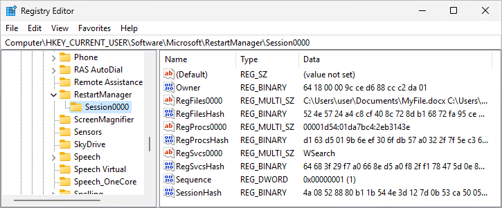

# Restart Manager Artifacts

**RestartManagerArtifacts** is a small **forensic** tool that can capture the state of the Restart Manager database on Windows systems.

## What is Restart Manager?

[Restart Manager](https://learn.microsoft.com/en-us/windows/win32/rstmgr/about-restart-manager) is a built-in API provided by `Rstrtmgr.dll` since Windows Vista. It allows programs to politely/forcefully ask other applications to unlock specific resources (mostly files). The intended users of this functionality are installer and updater developers who want to reduce the number of required system shutdowns.

When using this API, the caller registers a list of *resources* (files, processes, and services) that Restart Manager records in its database. Then, Restart Manager determines which applications and OS components it needs to shut down to unlock these resources and, upon confirmation, proceeds to (gracefully) do so. Later, the caller can request to restart affected applications. Note that the API does not grant additional access and can only shut down other programs if the caller has enough permissions.

## Why collect?

Some **ransomware** families (specifically Conti and Akira) are known to **abuse** this API to unlock files before encryption. Artifacts from the Restart Manager database can provide valuable insight into the infection timeline for incident response.

## Database structure

Restart Manager stores information about its sessions in a per-user registry location:

```
HKEY_CURRENT_USER\SOFTWARE\Microsoft\RestartManager
```

Despite being part of the registry, the key **only exists in memory** and does not persist in the corresponding hive file due to the [`REG_OPTION_VOLATILE`](https://learn.microsoft.com/en-us/windows/win32/api/winreg/nf-winreg-regcreatekeyexw#:~:text=REG_OPTION_VOLATILE) flag. In other words, shutting down the system **deletes** the key and its content. For the same reason, forensic tools that capture registry **hive files** for later analysis **do not allow** exploring the Restart Manager database because it only exists in the live registry.

Restart Manager stores information about each [session](https://learn.microsoft.com/en-us/windows/win32/api/restartmanager/nf-restartmanager-rmstartsession) in a dedicated sequentially-numbered `SessionXXXX` sub-key. The key can contain several values:
 - `Sequence` - a numerical value for synchronizing changes between multiple processes that [share the session](https://learn.microsoft.com/en-us/windows/win32/api/restartmanager/nf-restartmanager-rmjoinsession).
 - `Owner` - a binary value containing the PID and the precise start [timestamp](https://learn.microsoft.com/en-us/office/client-developer/outlook/mapi/filetime) of the process that created the session.
 - `RegFilesXXXX` - a set of sequentially numbered multi-string values containing the registered file resources. Each line stores a path to a file.
 - `RegProcsXXXX` - a set of sequentially-numbered multi-string values containing the registered application resources. Each line stores three hexadecimal values separated by colons that [uniquely encode](https://learn.microsoft.com/en-us/windows/win32/api/restartmanager/ns-restartmanager-rm_unique_process) a process via its PID and the start timestamp.
 - `RegSvcsXXXX` - a set of sequentially-numbered multi-string values containing the registered service resources. Each line stores a name of service.
 - Several binary values (`RegFilesHash`, `RegProcsHash`, `RegSvcsHash`, and `SessionHash`) with integrity checksums.



Additionally, because the storage medium is the registry, the system maintains the [`LastWriteTime`](https://learn.microsoft.com/en-us/windows-hardware/drivers/ddi/wdm/ns-wdm-_key_basic_information) timestamp for each session and the database root keys.

## Tool usage

> [!TIP]
> You can download the tool binary from the [Releases](https://github.com/huntandhackett/RestartManagerArtifacts/releases) page.

```
A tool for collecting Restart Manager artifacts by Hunt & Hackett.
Usage: RmArtifacts.exe [[-u <User name or SID>]] [[-o <Output XML file>]]
```

When invoked with no parameters, the tool displays data from the Restart Manager database of the current user. To specify another user, provide their account name or SID via the `-u` parameter. Note that this operation will most likely require admin rights and only works on currently logged-on users (since the database does not persist after logging out).

Additionally, the tool can capture detailed information (more detailed than the default output) into an XML file. You can use the `-o` parameter to specify the output file location.

Here is an example printed output:

```
Using the current user SID...

[*] Session0000
  Modified: 2024-06-20 06:44:29
  Owner: (PID 6244; started 2024-06-20 06:44:28)
  [Resources]
    File: C:\Users\user\Documents\MyFile.docx
    File: C:\Users\user\Documents\MyFile2.docx
    Application: (PID 7508; started 2024-03-21 21:15:48)
    Service: WSearch

Found 1 sessions.
```

And here is the corresponding XML file:

```xml
<?xml version="1.0" encoding="UTF-8" standalone="yes"?>
<Artifacts CaptureTime="2024-06-20 06:47:47" CaptureTimeRaw="133633324672300121">
  <SystemInfo>
    <System Name="DESKTOP-7P2CBIF" />
    <Boot BootId="2" BootTime="2024-06-20 06:09:33" BootTimeRaw="133633301735280569" />
  </SystemInfo>
  <RestartManagerDatabase UserSid="S-1-5-21-3769690586-2193241444-407356886-1001" LastWriteTime="2024-06-20 06:43:13" LastWriteTimeRaw="133633321933348889">
    <Session Name="Session0000" LastWriteTime="2024-06-20 06:44:29" LastWriteTimeRaw="133633322692406234">
      <Sequence Value="1" />
      <Owner PID="6244" StartedAt="2024-06-20 06:44:28" StartedAtRaw="133633322685746844" CurrentState="Terminated" />
      <RegisteredResources>
        <Group Type="File" Name="RegFiles0000">
          <File Path="C:\Users\user\Documents\MyFile.docx" />
          <File Path="C:\Users\user\Documents\MyFile2.docx" />
        </Group>
        <Group Type="Application" Name="RegProcs0000">
          <Application PID="7508" StartedAt="2024-03-21 21:15:48" StartedAtRaw="133555221488145470" CurrentState="Active" ImageName="\Device\HarddiskVolume3\Windows\explorer.exe" />
        </Group>
        <Group Type="Service" Name="RegSvcs0000">
          <Service Name="WSearch" />
        </Group>
      </RegisteredResources>
    </Session>
  </RestartManagerDatabase>
</Artifacts>
```

## Caveats

The primary limitation of the tool is that it can only capture information about Resource Manager sessions that are currently active or haven't been terminated correctly. Whenever a program calls [`RmStartSession`](https://learn.microsoft.com/en-us/windows/win32/api/restartmanager/nf-restartmanager-rmstartsession), Restart Manager either creates a new session key or reuses the first abandoned session key it finds. Explicitly terminating a session via [`RmEndSession`](https://learn.microsoft.com/en-us/windows/win32/api/restartmanager/nf-restartmanager-rmendsession) deletes its key and, thus, all artifacts. Failing to call `RmEndSession` before the session owner exits causes the key to become abandoned and persist until a reboot or an overwrite by another process. Luckily, ransomware samples often fail to clean up Restart Manager sessions and leave artifacts behind.

## Detection suggestions

We've observed the following Windows Event Log events on the default Windows configuration. Machines infected with Conti and Akira ransomware show excessive number of these events compared to normal.

Event ID | Source         | Level       | Description 
-------- | -------------- | ----------- | ----------
10000    | RestartManager | Information | Starting session
10001    | RestartManager | Information | Ending session
10002    | RestartManager | Information | Shutting down application or service
10005    | RestartManager | Information | Machine restart is required
10006    | RestartManager | Error       | Application or service could not be shut down
10010    | RestartManager | Warning     | Application cannot be restarted

While Restart Manager's event log entries don't provide almost any helpful details, it is possible to augment them with [Sysmon events 12-14](https://learn.microsoft.com/en-us/sysinternals/downloads/sysmon#event-id-12-registryevent-object-create-and-delete). You can configure logging for the `SOFTWARE\Microsoft\RestartManager` path under any/specified user hives.

## Other material

 - [Windows documentation on Restart Manager](https://learn.microsoft.com/en-us/windows/win32/rstmgr/about-restart-manager)
 - A blog by CrowdStrike: [The Windows Restart Manager: How It Works and How It Can Be Hijacked](https://www.crowdstrike.com/blog/windows-restart-manager-part-1/) and its [part 2](https://www.crowdstrike.com/blog/windows-restart-manager-part-2/).